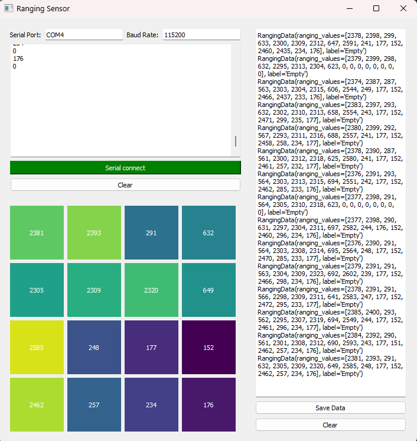

# STM32U5 IoT Node

---
This project contains all the necessary scripts to connect to an STM32_IoT board, record ranging sensor data, create a dataset and train a evaluate a Tiny ML which is run on the MCU.

